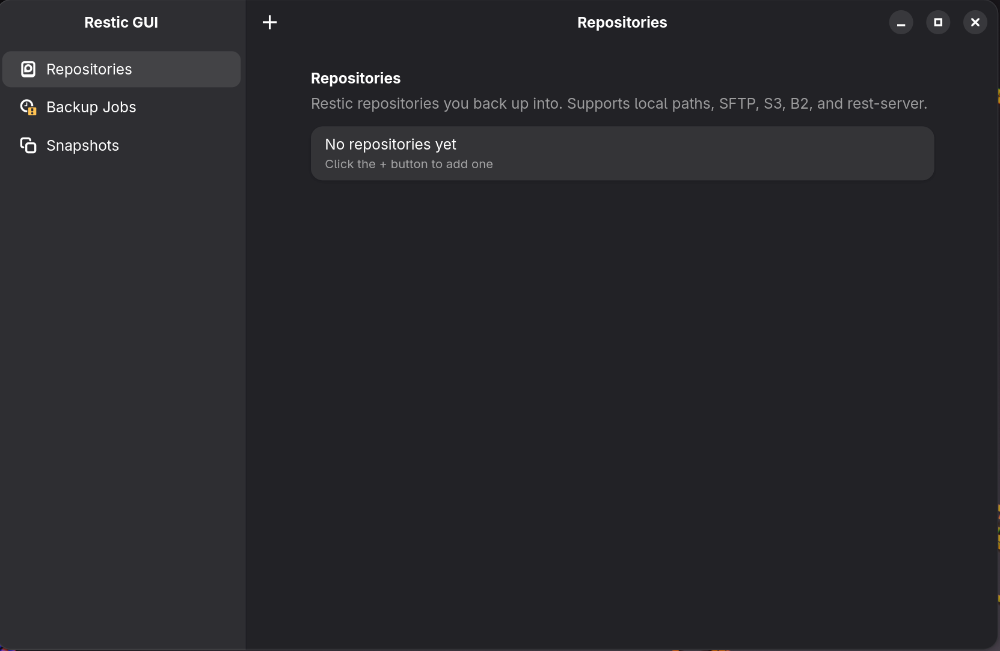
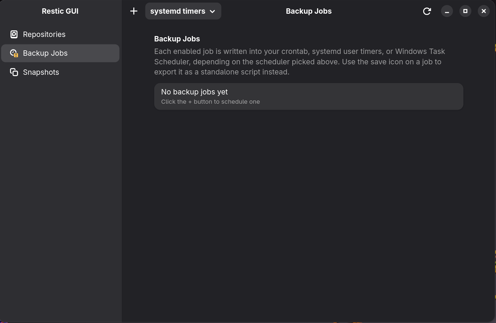
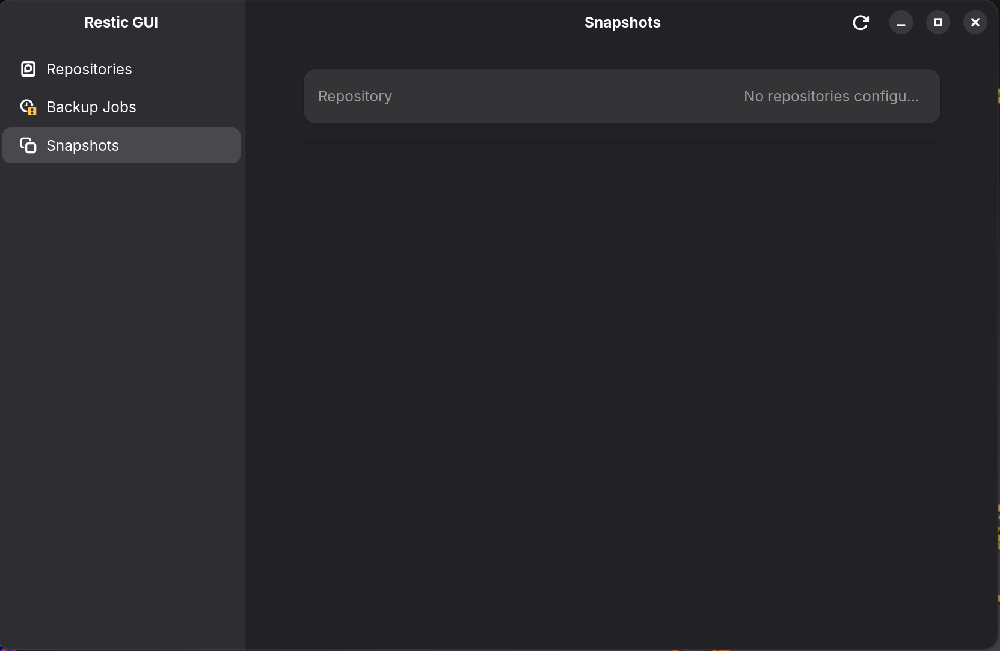
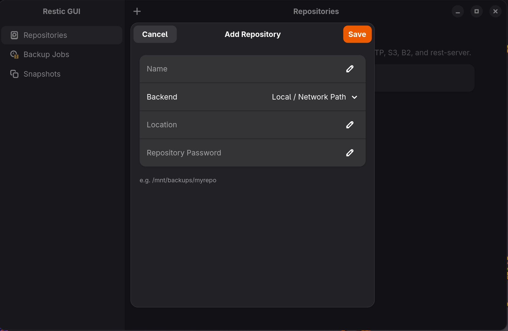
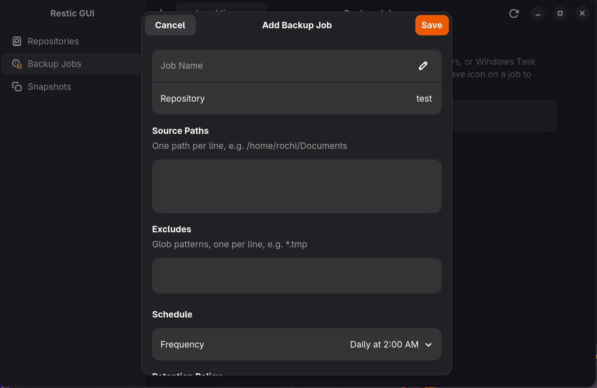
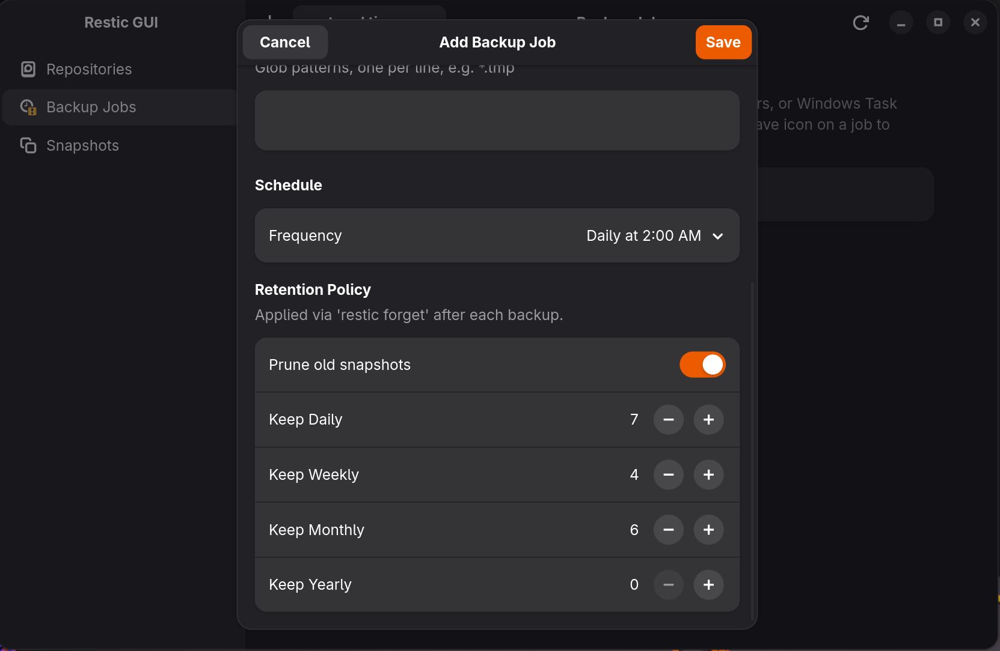
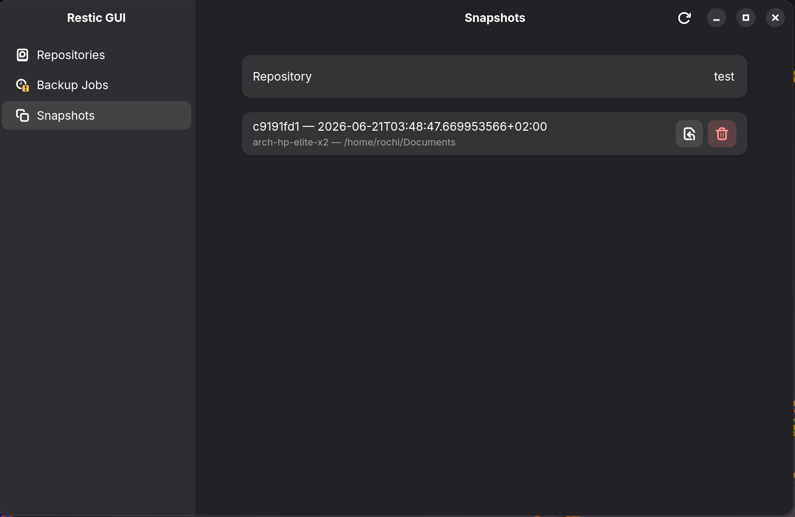

# Restic GUI

A GTK4 + libadwaita desktop app (written in Vala) for managing [restic](https://restic.net/) repositories, scheduling backups, and browsing/restoring snapshots — without ever touching restic's CLI directly.

> Repository: **[https://github.com/Rochi787/Restic-GUI](https://github.com/Rochi787/Restic-GUI)**

## Table of Contents

- [Features](#features)
- [Screenshots](#screenshots)
- [Install](#install)
- [Where things are stored](#where-things-are-stored)
- [Security model](#security-model)
- [Architecture](#architecture)
- [Known issues / Roadmap](#known-issues--roadmap)
- [Contributing](#contributing)
- [License](#license)

## Features

- **Repositories** — add local/network, SFTP, S3, B2, or rest-server backed restic repos. Initialize, check connectivity, edit, delete.
- **Backup Jobs** — pick source paths, excludes, a cron-style schedule (presets or a custom cron expression), and a retention policy (`restic forget --prune`).
- **Multiple scheduler backends** — sync jobs to whichever scheduler is actually available on the host, picked at runtime from a dropdown:
  - **cron** — written into a clearly marked, idempotent block in your user crontab; everything else in your crontab is left untouched.
  - **systemd user timers** — a `.service`/`.timer` pair per job under `~/.config/systemd/user/`.
  - **Windows Task Scheduler** — a scheduled task per job under `\ResticGui\`, running a generated PowerShell script.
  Switching backends in the dropdown tears down the old backend's entries before syncing the new one, so jobs don't end up scheduled twice.
- **Snapshots** — pick a repo, browse its snapshots, restore to a folder you choose, or forget an individual snapshot.
- **Export as script** — turn any job into a standalone `.sh` (Linux/macOS) or `.ps1` (Windows) script with credentials embedded, for use outside the app.

## Screenshots

  
  
  
  
  
  


## Install

### Arch

```bash
sudo pacman -S vala gtk4 libadwaita meson ninja json-glib libsecret restic
meson setup build
ninja -C build
./build/restic-gui
```

### Debian / Ubuntu

```bash
sudo apt install valac libgtk-4-dev libadwaita-1-dev libjson-glib-dev libsecret-1-dev meson ninja-build restic
meson setup build
ninja -C build
./build/restic-gui
```

> `libsecret` is required — the app stores repository passwords in your system keyring (GNOME Keyring, KWallet, etc.), not in a config file. Skipping it will fail at `meson setup`.

To install system-wide (adds it to your app launcher):

```bash
sudo meson install -C build
```

### Windows

There's no installer or prebuilt binary yet. The app can be built via [MSYS2](https://www.msys2.org/), which ships the same GTK4/libadwaita stack GNOME uses for its own Windows builds:

```bash
# In an MSYS2 "MinGW64" shell:
pacman -S mingw-w64-x86_64-vala mingw-w64-x86_64-gtk4 mingw-w64-x86_64-libadwaita \
          mingw-w64-x86_64-json-glib mingw-w64-x86_64-libsecret \
          mingw-w64-x86_64-meson mingw-w64-x86_64-ninja mingw-w64-x86_64-pkgconf
meson setup build
ninja -C build
./build/restic-gui.exe
```

Install [restic](https://restic.net/) separately (e.g. `winget install restic.restic`) and make sure it's on `PATH`.

> **Caveat:** libadwaita on Windows is supported by upstream but is less battle-tested than on Linux/macOS, and `libsecret` depends on a "Secret Service" provider that Windows doesn't ship natively — credential storage may not work out of the box (see [Known issues](#known-issues--roadmap)). The `WindowsTaskScheduler` backend (PowerShell script + `schtasks.exe`) itself only needs stock Windows, no extra install.

## Where things are stored

- `~/.config/restic-gui/repos.json` — repo definitions (name, backend, location, backend-specific env vars). **Passwords are not stored here** — see [Security model](#security-model).
- `~/.config/restic-gui/jobs.json` — backup job definitions.
- `~/.config/restic-gui/scheduler.json` — which scheduler backend (cron / systemd / Windows Task Scheduler) the Jobs page's "Sync" button targets.
- `~/.local/state/restic-gui/env/<repo-id>.env` — per-repo env file sourced by cron jobs at runtime (`0600`).
- `~/.local/state/restic-gui/scripts/<job-id>.sh` — standalone backup scripts used by systemd units.
- `~/.local/state/restic-gui/win-scripts/<job-id>.ps1` — standalone PowerShell scripts used by Windows Task Scheduler.
- `~/.local/state/restic-gui/logs/<job-id>.log` — backup output logs, for whichever backend is active.
- **Crontab**: a block delimited by `# >>> restic-gui managed jobs (do not edit by hand) >>>` / `# <<< restic-gui managed jobs <<<`. Anything outside that block in your existing crontab is preserved exactly as-is.
- **systemd user units**: `~/.config/systemd/user/restic-gui-<job-id>.{service,timer}`.
- **Windows Task Scheduler**: tasks under `\ResticGui\<job-id>`, tracked via a small manifest at `~/.local/state/restic-gui/win-tasks.json` (used to clean up tasks for removed/disabled jobs, since `schtasks` has no reliable "list by prefix" query).

## Security model

Repository passwords and backend credentials live in your **system keyring** via `libsecret` (`secret-manager.vala`), looked up by `repo_id`. They are intentionally excluded from `repos.json`.

> **Known gap:** the keyring lookup is wired up for in-app actions (Run now, Restore, Check, Init — see `ResticRunner.build_envp()`), but the scheduler sync paths (`CronManager.sync()`, `SystemdManager.sync()`, `WindowsTaskScheduler.sync()`) currently use the in-memory `Repository.password` field directly instead of fetching it from the keyring first. Since repos loaded from `repos.json` start with an empty password, **a freshly started app that hits "Sync" without re-opening each repo's edit dialog will write an empty `RESTIC_PASSWORD` into cron/systemd/Task Scheduler entries.** This is being tracked as the top-priority fix — see [Known issues](#known-issues--roadmap).

Exported scripts (`.sh` / `.ps1`) and per-repo env files contain the repository password in plaintext on disk, gated only by file permissions (`0600`/`0700`). Treat them accordingly.

## Architecture

```
src/
  main.vala                      entry point
  application.vala               Adw.Application, owns stores/services
  models/
    repository.vala              Repository + BackendType
    backup-job.vala              BackupJob; builds cron commands, bash + PowerShell scripts
    snapshot.vala                parsed `restic snapshots --json` entry
  services/
    restic-runner.vala           async wrapper around the restic CLI
    repo-store.vala              repos.json persistence
    job-store.vala               jobs.json persistence
    cron-manager.vala            safe managed-block crontab read/write
    systemd-manager.vala         systemd user timer/service generation + sync
    windows-task-scheduler.vala  schtasks.exe task generation + sync
    scheduler-prefs.vala         which scheduler backend is active
    secret-manager.vala          libsecret-backed credential storage
  ui/
    window.vala                  Adw.NavigationSplitView shell
    repos-page.vala / repo-edit-dialog.vala
    jobs-page.vala / job-edit-dialog.vala
    snapshots-page.vala
```

## Known issues / Roadmap

- **Scheduler sync doesn't pull passwords from the keyring** (see [Security model](#security-model)) — needs `CronManager`/`SystemdManager`/`WindowsTaskScheduler` `.sync()` to fetch each repo's password via `SecretManager` before writing env files/scripts.
- **No Secret Service provider on Windows** — `libsecret`'s `password_store`/`password_lookup` calls need a Secret Service backend, which Windows doesn't ship. Until this is bridged (or swapped for Windows Credential Manager on that platform), credential storage on a Windows build is unverified/likely broken even though the rest of the app compiles and runs.
- `restic ls` (browsing files inside a snapshot before restore) has a runner method (`list_snapshot_files`) but no UI yet — restore always restores the whole snapshot to a chosen folder.
- The Repos/Jobs page list-refresh rebuilds the whole `Adw.PreferencesGroup` each time rather than diffing rows — fine at homelab scale, not optimized for hundreds of entries.
- No drag-and-drop reordering of jobs.
- `EntryRow` password fields don't have the show/hide eye icon wired up (`Gtk.PasswordEntryRow` would be a nicer fit).
- `RepoEditDialog` doesn't clear stale S3/B2 env vars when switching a repo's backend type away and back.
- Cron → systemd / Windows Task Scheduler conversion is best-effort and rejects anything beyond the patterns this app's own presets (and similarly simple custom expressions) produce — see the comments in `systemd-manager.vala` / `windows-task-scheduler.vala` for exactly what's supported.

## Contributing

Issues and PRs are welcome at [github.com/Rochi787/Restic-GUI](https://github.com/Rochi787/Restic-GUI).

## License

MIT — see LICENSE for the full text.
